# Nacre

A small collection of VCV Rack 2 modules:

- **Nacre** — granular audio processor inspired by Mutable Instruments Beads
- **Stiletto** — stereo dual HP/LP filter inspired by Shakmat Dual Dagger
  (see [Stiletto](#stiletto) below)
- **Ammonite** — clocked multi-line stereo delay network inspired by Qu-Bit
  Nautilus (see [Ammonite](#ammonite) below)
- **Bitrot** — circuit-bent stereo buffer corrupter inspired by Qu-Bit Data
  Bender (see [Bitrot](#bitrot) below)
- **Sirocco** — live granular processor with melodic/rhythmic grain
  controls, inspired by Qu-Bit Mojave (see [Sirocco](#sirocco) below)
- **Espalier** — three-channel generative fractal sequencer inspired by
  Qu-Bit Bloom v2 (see [Espalier](#espalier) below)
- **Tektite** — stereo varispeed performance looper inspired by Qu-Bit
  Stardust (see [Tektite](#tektite) below)
- **Haymaker** — 12-pad sampler groovebox with step sequencer and punch-in
  FX, inspired by compact pad samplers (see [Haymaker](#haymaker) below)
- **Lariat** — CV/gate phrase looper (see [Lariat](#lariat) below)
- **Maelstrom** — voltage-controlled pitch-shifting echo inspired by Make
  Noise Echophon (see [Maelstrom](#maelstrom) below)
- **Chimera** — splice-based loop sampler with granular time-stretch,
  clock sync, scatter, EQ, and sound-on-sound (see [Chimera](#chimera)
  below)
- **Catgut** — dual-voice 32-string polyphonic Karplus-Strong synthesizer
  inspired by Strymon SuperKar+ (see [Catgut](#catgut) below)
- **Capo** — four-voice polyphonic chord oscillator inspired by Qu-Bit
  Chord v2 (see [Capo](#capo) below)
- **Fretwork** — polyphonic performance quantizer (see
  [Fretwork](#fretwork) below)
- **Murmur** — polyphonic macro oscillator running the open-source Plaits
  DSP (see [Murmur](#murmur) below)
- **Fieldfare** — OP-1 Field-inspired pocket studio: multi-engine synth,
  4-track tape, sampler, and endless sequencer (see [Fieldfare](#fieldfare)
  below)
- **Orrery** — dual function generator inspired by Make Noise Maths
  (slug `Abacus`; see [Orrery](#orrery) below)
- **Osprey** — triple-mode stereo oscillator (traditional / 24-osc swarm /
  20-chord engine) inspired by BlaknBlu Oscar Tria (see [Osprey](#osprey)
  below)
- **Foxglove** — stereo multimode VA filter (ladder / Sallen-Key / state
  variable) inspired by BlaknBlu Foxtrot Duo (see [Foxglove](#foxglove)
  below)
- **Remora** — 32-program stereo multi-FX inspired by Happy Nerding FX AID
  (see [Remora](#remora) below)

## Nacre

A granular audio processor inspired by the feature set of
Mutable Instruments **Beads**.

The Beads firmware was never open-sourced, so this is an **original DSP
implementation** of the same concept, not a port. The only borrowed code is
the reverb stage, which uses Émilie Gillet's MIT-licensed Clouds reverb
(`eurorack/clouds/dsp/fx/reverb.h`, vendored with its license intact).

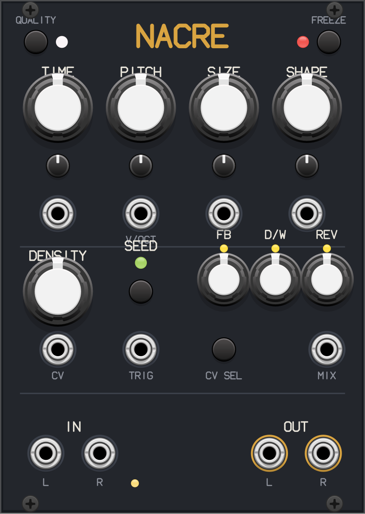

## Signal flow

Audio in → (feedback mix, quality character) → 8-second stereo recording
buffer → up to 64 simultaneous grains → dry/wet crossfade → reverb → out.

## Controls

### Grain parameters (each with attenurandomizer + CV input)
- **TIME** — playback position in the buffer. Fully CCW plays the newest
  audio, fully CW reaches ~6.5 s into the past.
- **PITCH** — grain transposition, ±24 semitones with "virtual notches" that
  snap near semitones. The CV input is 1 V/oct, scaled by the
  attenurandomizer.
- **SIZE** — grain duration, 30 ms to 4 s. The lower half of the knob range
  plays grains in reverse.
- **SHAPE** — grain envelope: clicky rectangular (CCW) → hann (center) →
  slow attack (CW).

**Attenurandomizers**: with a cable patched, CW of center scales the CV.
CCW of center (or either side with nothing patched) applies per-grain random
deviation — uniform on the CCW side, bell-shaped ("peaky") on the CW side.

### Grain generation
- **SEED button** — fires a grain manually. Hold 2 s to toggle between
  *latched* mode (internal scheduler, LED bright) and *gated* mode (grains
  only on triggers, LED dim).
- **SEED input** — trigger input; patching it switches to triggered mode.
- **DENSITY** — in latched mode: no grains at center, increasingly fast
  *metronomic* generation CW, increasingly fast *randomized* generation CCW
  (up to 250 Hz). In triggered mode: CCW sets the probability that a trigger
  produces a grain, CW adds ratcheting bursts (up to 8 grains per trigger).
  The CV input adds to the knob.

### Recording
- **QUALITY button** — cycles three recording characters:
  - *blue* — vintage digital: half-rate sample-hold + 12-bit quantization
  - *green* — clean
  - *red* — tape: saturation on record, wow/flutter on playback
- **FREEZE button** — stops recording; grains keep playing from the frozen
  buffer.

### Mix section
- **FB** — feedback of the granulated signal into the record head
  (DC-blocked, soft-limited).
- **D/W** — equal-power dry/wet crossfade.
- **REV** — reverb amount (also scales decay time and damping).
- **CV SEL button + MIX input** — assigns the MIX CV input to one of the
  three mix knobs (yellow LEDs show the destination).

### I/O
- **IN L/R** — mono or stereo input (L normalled to R and vice versa).
  The LED next to the inputs shows level (red = clipping, signals are
  normalized to ±5 V).
- **OUT L/R** — stereo output.

## Differences from the hardware
- No wavetable-synthesizer mode (hardware activates it when no input is
  patched for 10 s).
- No automatic input gain; feed it ±5 V audio.
- The infinite-grain "delay mode" at SIZE fully CW is approximated by 4 s
  grains rather than a dedicated delay algorithm.
- One CV input per mix parameter destination (selected with CV SEL), as on
  hardware; quality and freeze are also available from the context menu.

## Stiletto

An original implementation of the Shakmat Dual Dagger architecture: a stereo
filter with, per channel, a 24 dB/oct high-pass into a 24 dB/oct low-pass
(four ZDF ladder filters total).

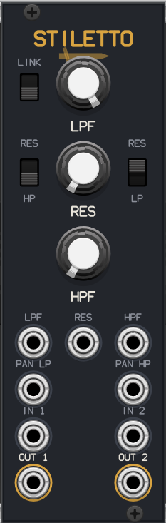

- **LPF / HPF** — cutoff knobs (20 Hz–20 kHz) shared by both channels, with
  1 V/oct CV inputs.
- **RES** — one resonance control (plus CV), routed to the low-pass pair
  and/or the high-pass pair via the **RES LP** / **RES HP** switches.
- **LINK** — bandpass mode: the HPF control moves all four filters (band
  frequency) and the LPF knob becomes bandwidth, giving an 8th-order stereo
  bandpass.
- **PAN LP / PAN HP** — CV inputs that push channel 1's cutoff up while
  pushing channel 2's down (½ octave per volt), for stereo spectral spread.
- **IN 2** is normalled to IN 1; feed a mono source and use the pan CVs for
  stereo movement.
- Context menu: **Hi resonance range** (the hardware's back-panel jumper) —
  allows self-oscillation.

"Shakmat" and "Dual Dagger" are trademarks of their owner; this project is
not affiliated with or endorsed by them.

## Ammonite

An original implementation of a clocked multi-line delay network in the
style of the Qu-Bit Nautilus: 8 delay lines (4 per channel), all synced to
an internal or external clock.

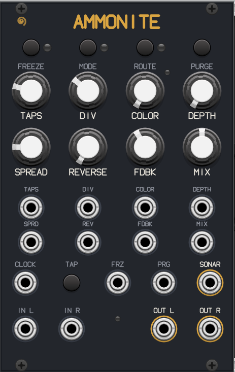

- **TAP button / CLOCK input** — tap tempo (default 120 BPM) or external
  clock; range 0.25 Hz–1 kHz.
- **DIV** — 16 clock divisions/multiplications from 2 bars to a 512th note.
- **TAPS** — number of active delay lines per channel (1–4); lines fade in
  and out smoothly.
- **SPREAD** — spacing between line times (tight slapback cluster →
  polyrhythmic spread); also offsets the right channel slightly for width.
- **REVERSE** — incrementally flips lines to backwards playback in the
  order 1L, 1R, 2L, 2R…
- **COLOR + DEPTH** — six feedback-path effects (LED-coded): lowpass (blue),
  highpass (green), crush (purple), saturate (orange), wavefold (cyan),
  distort (red). DEPTH sets the amount; the effect is recorded into the
  lines like the hardware's Chroma.
- **Delay modes** (MODE button): Fade (crossfades on time changes), Doppler
  (slewed time = tape-style pitch bends), Shimmer (+1 oct in feedback),
  De-shimmer (−1 oct in feedback).
- **Feedback routing** (ROUTE button): Normal (each line to itself),
  Ping-pong (L↔R), Cascade (series chain through all 8 lines), Adrift
  (routing re-randomized every clock).
- **FREEZE** (button + gate) — loops the lines at their current length.
  **PURGE** (button + trigger) — clears all lines.
- **SONAR output** — envelope follower CV of the delay network (or a gate,
  via the context menu).
- Every knob has a CV input (±5 V). Max line time is 10 s.

"Qu-Bit" and "Nautilus" are trademarks of Qu-Bit Electronix; this project
is not affiliated with or endorsed by them.

## Bitrot

An original implementation of a circuit-bent audio buffer in the style of
the Qu-Bit Data Bender: a continuously recording stereo buffer is played
back in clocked chunks that can stutter, jump, reverse, bend, and fail.

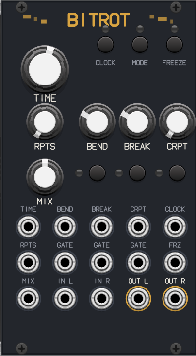

- **TIME** — window length. Internal clock: smooth 16 s down to 12.5 ms.
  With external clock (CLOCK button/jack): 9 div/mult steps from ÷16 to ×8.
- **RPTS** — subdivides the window into 1–32 chunks (stutter rate).
- **BEND** — in *macro* mode (MODE button), clocked tape-machine failures:
  random varispeed, reverse, half/double speed, tape stops, with slewed
  speed changes at higher settings. In *micro* mode it is a direct playback
  speed control (±3 octaves); its button toggles reverse.
- **BREAK** — in macro mode, digital-failure glitches: playhead jumps to
  random chunks and randomized silence at high settings. In micro mode it
  selects the active chunk (traverse) or sets a silence duty cycle (its
  button toggles which).
- **CRPT + button** — end-of-chain corruption: Decimate (bit crush + rate
  reduction, blue), Dropout (random mutes, long→short, green), Destroy
  (saturation into hard clipping, red). The gate input cycles effects.
- **FREEZE** — stops recording; latches on the next chunk boundary by
  default (instant mode in the context menu).
- **MIX** — dry/wet. All six knobs have ±5 V CV inputs; bend/break have
  toggle gate inputs.
- Context menu: stereo *unique/shared* randomness, *glitch windowing*
  (crossfade per chunk: clicky → fully windowed), instant freeze.

"Qu-Bit" and "Data Bender" are trademarks of Qu-Bit Electronix; this
project is not affiliated with or endorsed by them.

## Sirocco

An original implementation of a *musical* live granular processor in the
style of the Qu-Bit Mojave: grains are generated from a continuously
recording stereo buffer, with rhythm and pitch shaped by clock sync, scale
quantization, and stochastic controls.

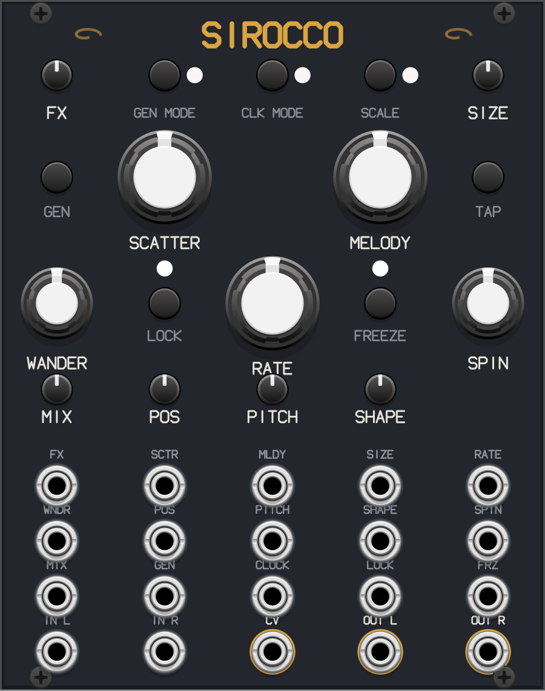

- **RATE** — grain frequency, smooth (0.25 Hz–160 Hz) in free clock mode, or
  11 div/mult steps of the tap/external clock in quantized mode (CLK MODE
  button, blue/gold).
- **SCATTER** — rhythmic variation: free mode adds timing jitter; quantized
  mode adds grid-locked rests and ratchets.
- **MELODY** — zoned random pitch: none → semitones → octaves+semitones →
  octaves → scale notes → arpeggio/trill events.
- **SCALE button** — major / minor / chromatic / unquantized, applied to
  MELODY offsets and the PITCH knob (PITCH CV is 1 V/oct).
- **SIZE** — bipolar: 20 ms blip at center, forward grains up to ~4 s
  clockwise (capped at 10× the grain period), reverse counter-clockwise
  (window shape flips for reverse grains).
- **SHAPE** — grain window morphing through hamming, up-ramp, triangle,
  exponential decay, and square.
- **POS + WANDER** — buffer position and random position spread (quantized
  to beats in quantized clock mode). **LOCK** stops recording and turns POS
  into a buffer scrub.
- **SPIN** — random per-grain stereo panning.
- **FX** — bipolar macro: feedback left of center, reverb right of center
  (the Clouds reverb).
- **GEN MODE** — Erode (scheduler + GEN), Shear (grains triggered by input
  level), Chisel (GEN button/gate only).
- **FREEZE** — locks the grain parameter snapshot for stutter effects while
  the buffer keeps recording.
- **CV output** — algorithmic modulation: a morphing ramp whose speed,
  direction-flipping, and steppedness follow SPIN, WANDER, and SCATTER, or
  (context menu) grain gates / clock pulses.
- Every knob has a ±5 V CV input. The hardware's onboard microphone is
  omitted (patch any signal instead).

"Qu-Bit" and "Mojave" are trademarks of Qu-Bit Electronix; this project is
not affiliated with or endorsed by them.

## Espalier

An original implementation of a three-channel generative ("fractal")
sequencer in the style of the Qu-Bit Bloom v2. Each channel holds a 64-step
trunk sequence (note, gate on/off + length, slew, ratchet, mod per step)
with note, gate, and mod outputs.

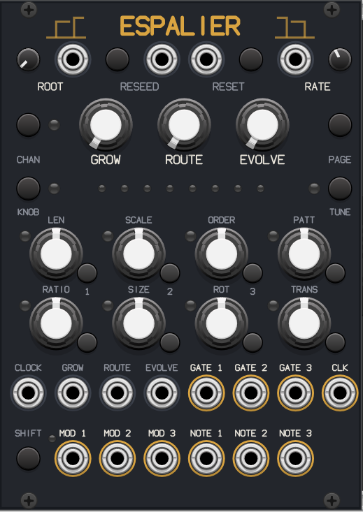

- **GROW** — adds up to 7 generative branches that play after the trunk;
  each branch transforms the previous one (reverse, inverse, octave
  transpose, seeded mutation, or randomization), giving up to 512-step
  evolving sequences. Shift+RESEED rolls new branch transformations.
- **ROUTE** — selects the order the branches are traversed (128 paths).
- **EVOLVE** — probabilistic, destructive mutation of the trunk: notes on
  the lower half of the knob, gate length/state changes on the upper half.
- **KNOB mode button** re-purposes GROW/ROUTE/EVOLVE: *Micro mutate*
  (destructive per-step ratchet/slew/mod randomization) and *Performance*
  (non-destructive ratchet and slew effects, plus musical ornaments —
  octave/fifth leaps, runs, turns, mordents, trills — on the top half of
  EVOLVE).
- **8 step knobs + on/off buttons** edit the focused channel's current
  page in the active **TUNE mode** (note / gate length / slew / ratchet
  ×1–×32 / mod). Knobs use value-pickup so changing page, channel, or mode
  never jumps your data. **PAGE** cycles the 8-step pages; **CHAN** cycles
  the focused channel (LED color-coded).
- **SHIFT + step knobs** set per-channel: length (1–64), scale (8 options),
  playback order (forward/reverse/pendulum/random/converge/diverge/both/
  page-jump), mod-output mode, clock ratio (÷8…×8), resize (non-destructive
  ⅛…×8 stretch), rotate, and diatonic transpose.
- **ROOT** (knob + CV) transposes diatonically — everything stays in key.
- **RESEED** (button + gate) dice-rolls the focused channel; **RESET**
  returns all channels to step 1.
- **RATE** sets the internal clock (fully left = external CLOCK input);
  CLK output passes the clock on.
- **MOD outputs** per channel: velocity steps, smoothed CV, per-step AD
  envelopes, or per-step LFO shapes (shift + MOD knob selects).
- Omitted from the hardware: pattern save slots, USB/web-app settings, and
  the TRS MIDI jack (use Rack's CV-MIDI modules).

"Qu-Bit" and "Bloom" are trademarks of Qu-Bit Electronix; this project is
not affiliated with or endorsed by them.

## Tektite

An original implementation of a tape-style stereo performance looper in
the spirit of the Qu-Bit Stardust, with a 60-second buffer.

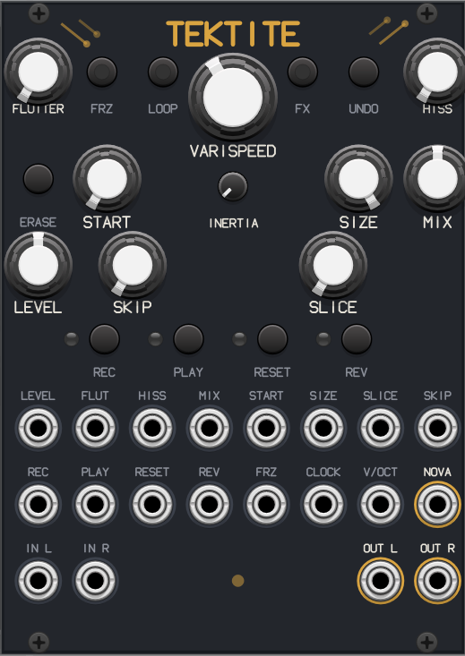

- **Recording**: the first recording sets the loop length; further
  recordings layer into the loop per the **LOOP mode**: sound-on-sound
  (add), replace, fripper (older layers decay with each pass), or resample
  (the mangled playback — speed, slices, skips and all — becomes a fresh
  loop). **UNDO** swaps back the pre-recording state; **ERASE** clears.
- **Transport**: REC, PLAY/pause, RESET, REV buttons with gate inputs.
- **VARISPEED** — −2 to +3 octaves of tape-style speed/pitch, with a
  1 V/oct input and selectable quantization (free / semitones /
  octaves+fifths / octaves). **INERTIA** adds up to seconds of motor lag to
  speed changes and play/pause — instant tape stops.
- **START / SIZE** — window the loop anywhere in the recorded buffer (down
  to 5 ms), with CV.
- **SLICE** — subdivides the loop (2–32 splices, ≥62 ms) with random
  splice repeats. **SKIP** — nine zones of probabilistic splice
  transformations: start offsets, reversed slices, pan/level changes,
  micro-pitch, octave jumps, random semitones, tape-lag pitch slides, and
  combination zones.
- **FX mode button + FLUTTER/HISS knobs** — four always-running effect
  pairs, the knobs editing the selected pair (with value pickup): tape
  (wow-flutter / hiss+compression), digital (downsample / bitcrush),
  reverb (amount / time), filter (high-pass / low-pass).
- **FREEZE** (button + gate) — locks and repeats a sliver of the loop
  (1 % of loop length; 1/32 of the clock when CLOCK is patched).
- **NOVA output** — loop-end and/or slice-end gates, or playback position
  as CV (context menu).
- **LEVEL** — input gain with tape saturation past center; **MIX** —
  constant-power dry/wet.
- Omitted from the hardware: USB loop file import/export, persistent
  buffer storage, punch-in record modes, and undo-lock.

"Qu-Bit" and "Stardust" are trademarks of Qu-Bit Electronix; this project
is not affiliated with or endorsed by them.

## Haymaker

An original 12-pad sampler/composer groovebox in the spirit of compact pad
samplers such as Teenage Engineering's EP-133 K.O. II.

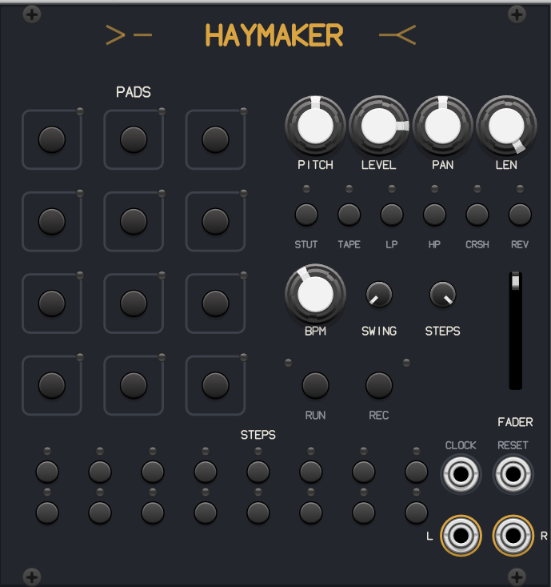

- **12 pads**, each with its own sample slot. A procedurally synthesized
  drum kit (kick, snare, clap, rim, hats, toms, cowbell, shaker, zap) is
  built in, so it makes sound out of the box. Load your own WAVs (16/24-bit
  PCM, 32-bit float, mono/stereo, any sample rate, up to 20 s) per pad via
  the context menu. Pads are MIDI-mappable like any Rack button.
- **PITCH / LEVEL / PAN / LEN knobs** edit the last-pressed pad (value
  pickup — switching pads never jumps settings). Retriggering a pad chokes
  its own voice for tight drums.
- **16-step sequencer × 12 tracks**: the step buttons edit the selected
  pad's lane (green = active, red = playhead). RUN starts/stops; **REC**
  live-captures pad presses quantized to the grid. **BPM** (40–240),
  **SWING**, and **STEPS** (pattern length 1–16). The CLOCK input (16th
  notes) overrides the internal clock; RESET restarts the pattern.
- **Punch-in FX** (hold buttons): stutter loop, tape stop, low-pass sweep,
  high-pass sweep, bitcrush, and reverse — with the **FADER** setting the
  intensity (loop length, stop speed, sweep depth, crush amount).
- Stereo output with gentle soft-clipping. Patterns, slot settings, and
  sample file paths are saved with the patch.
- Omitted compared to hardware workstations: scenes/song mode, internal
  resampling, battery, and the speaker (your call on the speaker).

"Teenage Engineering", "EP-133", and "K.O. II" are trademarks of Teenage
Engineering; this project is not affiliated with or endorsed by them.

## Lariat

A CV/gate phrase looper. Patch it between a controller (e.g. Rack's
MIDI-CV) and a voice: it passes its four lanes (V/OCT, GATE, CV 1, CV 2)
straight through until you record.

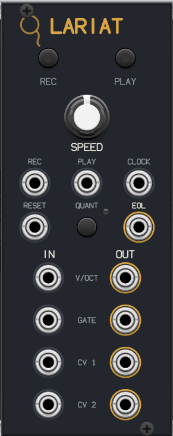

- **REC** (button or gate) starts capturing all four lanes (sampled at
  4 kHz, up to 4 minutes); press again to stop — the phrase immediately
  starts looping out of the OUT jacks while the inputs go quiet.
- **PLAY** toggles the loop; while stopped (or recording) the module is a
  transparent pass-through, so you can keep playing live.
- **SPEED** (¼×–4×) time-stretches the phrase with *no pitch change*,
  since it is control voltage being looped, not audio.
- **CLOCK input**: when patched, the loop length is quantized to a whole
  number of clock periods on record-stop (padded with held CV and closed
  gate), keeping the phrase locked to the rest of the patch.
- **RESET** jumps to the loop start; **EOL** fires a trigger each pass.
- Gates are reconstructed cleanly (thresholded to 0/10 V); loops up to
  60 s are saved with the patch. Monophonic (one note lane) in v1.

## Maelstrom

An original implementation of a voltage-controlled pitch-shifting echo in
the style of the Make Noise/soundhack Echophon: a mono delay line feeding
a granular pitch shifter, with two feedback paths crossfaded on a single
bipolar knob.

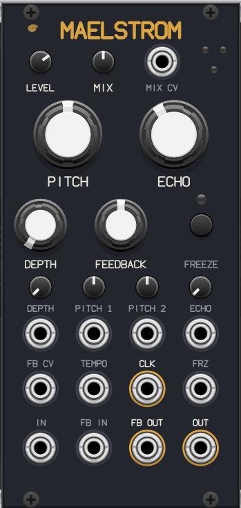

- **ECHO** — delay time, 7 ms–1.7 s (exponential), with CV + attenuator.
  Time changes are slewed tape-style, so sweeps re-pitch musically. With a
  clock at **TEMPO**, the knob becomes a div/mult (÷8…×8) of the clock;
  **CLK** outputs the echo rate as pulses.
- **PITCH + DEPTH** — the pitch knob is bipolar (down/up), but its range is
  always scaled by DEPTH: zero depth = no shift, low depth = subtle chorus,
  full depth = ±2 octaves. DEPTH has a CV input + attenuator. **PITCH 1**
  (±4 V, attenuverter) suits LFO vibrato; **PITCH 2** (±2 V = full range)
  suits sequencers/keyboards.
- **FEEDBACK** — bipolar: counter-clockwise feeds the *shifted* signal back
  (each repeat shifts again — spiraling echoes that climb or dive),
  clockwise feeds the plain echo back (conventional repeats). CV with
  attenuverter crossfades the loops.
- **FB OUT / FB IN** — external feedback loop insert (AC-coupled return)
  for filtering or waveshaping the regeneration externally.
- **FREEZE** (button + gate) holds the echo chamber's contents.
- **LEVEL** overdrives the input toward the top of its range; **MIX** is a
  combo-pot (the MIX CV input scales the knob).

"Make Noise", "soundhack", and "Echophon" are trademarks of their owners;
this project is not affiliated with or endorsed by them.

## Chimera

An original splice-based stereo loop sampler in the lineage of tape-style
micro-sound samplers (Morphagene and friends), built around a granular
engine that fully decouples time from pitch.

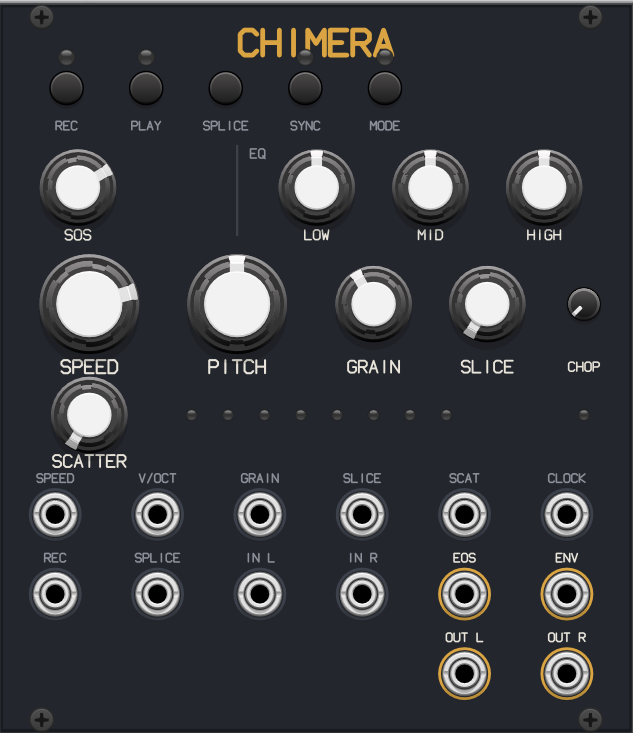

- **Reel**: record from the inputs (first recording sets the reel, up to
  60 s; REC again later overdubs at the playhead with the **SOS** knob
  setting how much of the old layer survives), or load a WAV via the
  context menu (any bit depth/rate, resampled on load). A built-in demo
  arpeggio loop plays out of the box. The reel and splices are saved
  inside the patch.
- **MODE button** — *tape* (default): pristine direct playback with an
  equal-power crossfade at every loop point for seamless cycling; pitch
  and speed merge varispeed-style. *Stretch*: the granular engine
  decouples time from pitch, with grains wrapped inside the slice so
  synced loops also cycle without seams.
- **SPEED** (−2×…+2×, through zero): time control. In stretch mode, stop
  the playhead at 0 for a frozen sustained texture; negative plays
  backwards. With **SYNC** on and a clock patched, the current slice is
  stretched to occupy a whole number of beats and the knob snaps to
  musical multipliers (¼×–4×) — loops lock to your patch tempo at any
  natural length (use stretch mode to keep the original pitch while
  synced).
- **PITCH** (±12 st + 1V/oct input): in stretch mode fully independent of
  speed; in tape mode it re-tunes the tape. **GRAIN** sets the granular
  window (20–500 ms): small = smeary, large = chunky.
- **CHOP** auto-slices the reel into 1–32 equal slices; the **SPLICE**
  button/trigger drops custom markers at the playhead (these override the
  chop grid). **SLICE** (knob + CV) selects the playing slice; the LED row
  shows it.
- **SCATTER**: probability of jumping to a random slice (and sometimes
  reversing) at each slice end — beat-mangling without leaving the groove.
- **EQ**: low shelf (120 Hz), mid bell (1 kHz), high shelf (6 kHz), ±12 dB
  each, plus a gentle output limiter.
- **EOS** fires at every slice end; **ENV** is an envelope follower of the
  output for sidechain-style patching.

## Catgut

An original implementation of a dual-bank polyphonic Karplus-Strong string
synthesizer in the style of the Strymon SuperKar+: a **Solo voice** and a
**Chord voice**, each with sixteen physically-modeled strings (32 total).

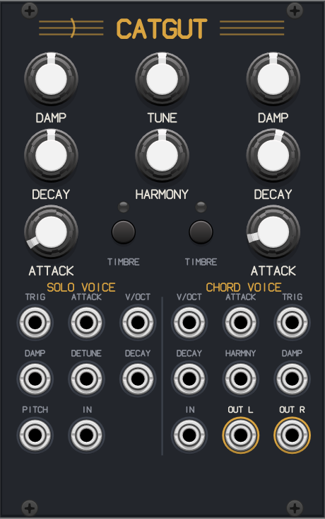

- Per voice: **DAMP** (in-loop high-frequency damping, ringing → muted),
  **DECAY** (sustain from percussive to effectively infinite), **ATTACK**
  (sharp strike → soft bow), each with a CV input, plus a **TIMBRE**
  button flipping the loop feedback polarity — positive (green) for
  string-like tones, negative (red) for hollow tube/pipe tones (pitch is
  compensated so notes stay in tune).
- **TUNE** (shared, ±½ octave, semitone-quantized by default) and
  **HARMONY** — 15 settings from fixed intervals (octaves, fifths) to
  *smart harmonies* that stack scale-aware thirds above the root, with the
  scale (major, harmonic minor, aeolian, dorian, lydian, phrygian,
  expanded major, major triads) chosen in the context menu. HARMONY has a
  CV input.
- **Solo voice**: V/OCT + TRIG accept **polyphonic cables** (up to 16
  channels = 16 independently gated strings — Rack's MIDI-CV drives it
  polyphonically). With mono cables, triggers round-robin through the
  polyphony count (context menu, 1–16) so notes ring into each other.
  **DETUNE** CV adds random per-note tuning error; **PITCH** bends all
  ringing solo strings ±1 octave.
- **Chord voice**: root V/OCT (semitone-quantized) + TRIG strikes the
  whole chord.
- **IN** jacks excite each bank's strings with external audio —
  sympathetic resonance.
- Context menu: output mode (wide / narrow / split / mono), per-voice
  glide and level, solo polyphony, tune quantize.
- Tuning is compensated for the damping filter's phase delay (verified
  within ~1 cent across the range in standalone tests).

"Strymon" and "SuperKar+" are trademarks of Damage Control Engineering,
LLC; this project is not affiliated with or endorsed by them.

## Capo

An original implementation of a four-voice chord oscillator in the style
of the Qu-Bit Chord v2: root, third, fifth, and seventh oscillators with
individual outputs plus a mix.

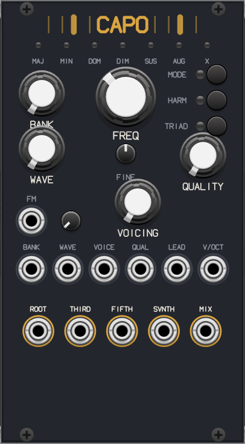

- **BANK + WAVE**: eight wavetable banks, all procedurally synthesized at
  startup (classic shapes, filtered saw, two-operator FM, waveshaped,
  vocal formants, PWM pulse, chiptune pulses, organ drawbars). WAVE morphs
  smoothly within the bank; both have CV inputs. A **linear FM** input
  with attenuator modulates all four voices.
- **FREQ** (7 octaves) + **FINE** (±5 st) + V/OCT input set the chord
  root.
- **QUALITY** selects eight seventh-chord types (maj7, min7, dom7,
  half-diminished, dim7, sus2maj7, sus4min7, aug7), shown on the LED row.
  **VOICING** selects 16 voicings — closed, drops, inversions, raises, and
  spreads — by octave-shifting individual chord tones. Both have CV.
- **MODE button**: *chord* (default), *melody* (the LEAD input re-pitches
  the seventh as an independent lead over the chord), *free poly* (all
  four oscillators on independent CVs: V/OCT, LEAD, VOICE, QUAL), and
  *unison poly* (all four track the root with per-jack offsets).
- **HARM button**: diatonic auto-harmonization — quantizes the root (and
  lead) to major or minor and re-selects the chord quality per scale
  degree so progressions stay in key; poly modes add a chromatic option.
- **TRIAD button**: drops the seventh from the mix (level-compensated) —
  handy when the lead plays over a triad bed.
- Omitted from hardware: SD-card user wavetables and config files.

"Qu-Bit" and "Chord" are trademarks of Qu-Bit Electronix; this project is
not affiliated with or endorsed by them.

## Fretwork

An original polyphonic quantizer built for performance:

- **Fully polyphonic** (16 channels) 1V/oct in → quantized out.
- **14 scale presets** (chromatic, the church modes, harmonic/melodic
  minor, pentatonics, blues, whole tone) on the SCALE knob with **1 V per
  scale CV** — plus a 12-key button column to edit the active notes
  directly (selecting a preset reloads the keys; edits persist with the
  patch). Key lights: dim = enabled, bright = currently sounding.
- **ROOT** knob + CV transposes the scale; **OCT** shifts the output ±4
  octaves.
- **TRANS input**: diatonic transpose at 1 V per scale degree — melodies
  shift through the harmony without ever leaving the key.
- **TRIG input** switches to clocked sample-and-hold quantizing;
  unclocked, a hysteresis window stops notes fluttering at boundaries.
- **GATE output** fires a trigger on every note change (per poly channel) —
  free envelope plucks downstream.
- Context menu: rounding mode (nearest / up / down).

## Murmur

A polyphonic macro oscillator: up to **16 simultaneous voices of Plaits**,
Émilie Gillet's MIT-licensed macro-oscillator firmware, vendored verbatim
under `eurorack/plaits/` with its license intact. The Rack integration and
polyphony wrapper are original.

- **V/OCT and TRIG accept polyphonic cables** — each channel is an
  independent full Plaits voice (Rack's MIDI-CV in poly mode plays it like
  a 16-voice synth). OUT and AUX outputs are polyphonic.
- All **24 engines** (virtual analog, FM including the six-op banks,
  wavetable, chords, speech, particle, modal, percussion, and the rest)
  selected by the MODEL knob/CV, with the engine shown on the light row
  (color = bank) and a named engine list in the context menu.
- The classic control set: FREQ, HARMONICS, TIMBRE, MORPH with
  attenuverted CV inputs (TIMBRE/MORPH/FM CVs are polyphonic too), LEVEL
  input, and the internal low-pass gate (DECAY + LPG colour) when TRIG is
  patched.
- Internally renders at Plaits' native 48 kHz and resamples to the engine
  rate.

Plaits is © Émilie Gillet, MIT license. "Mutable Instruments" and
"Plaits" are trademarks of their owner; this module is not affiliated
with or endorsed by Mutable Instruments.

## Fieldfare

A pocket-studio voice inspired by the Teenage Engineering **OP-1 Field**,
in Eurorack form. Original implementation.

- **Four color macro knobs** that reassign across four pages (SOUND / ENV /
  FX / MIX), remembering their settings per page.
- **Seven synth engines** (FM duo, saws, pulse, wavetable, Karplus-Strong
  string, grit percussion, and a chromatic sampler), 4-voice polyphonic
  from poly V/OCT + GATE.
- **Four-track 60-second tape** with ±2-octave varispeed (motor inertia),
  reverse, loop brace, and per-track levels; records the synth and the
  external input.
- **Sampler**: hold REC to sample the audio inputs, then play it back
  chromatically.
- **Endless sequencer** (off → record → play), plus master drive and a
  Clouds reverb. Ten preset sounds (lush pads, bells, leads…) in the menu.

Inspired by the OP-1 Field; an independent work, not affiliated with or
endorsed by Teenage Engineering.

## Orrery

A dual function generator inspired by Make Noise **Maths**. Original
implementation. (The module's slug is `Abacus` for patch compatibility; it
displays as Orrery.)

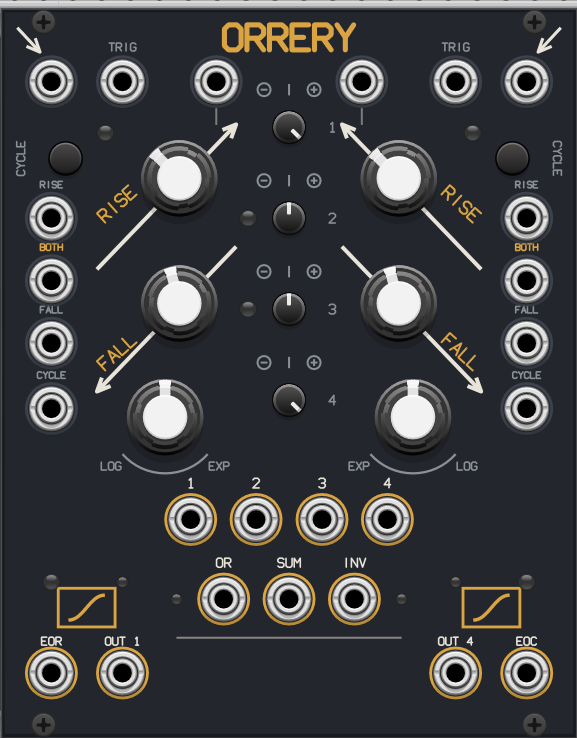

- **Two function generators** (channels 1 & 4) with rise, fall, and a
  continuously variable response from logarithmic through linear to
  exponential and hyper-exponential. Cycle for an LFO; trigger for an
  envelope. 0.5 ms to ~25 min range.
- **Two offset/scaling channels** (2 & 3), normalled to +10 V and +5 V.
- **SUM, inverted SUM, and analog OR** buses; patching a channel's variable
  output removes it from the buses, exactly like the hardware.
- EOR / EOC gates, BOTH and per-channel CV, cycle gates, and the
  channel/bus indicator LEDs.

Verified against the official Maths 2013 manual: self-cycling peaks at 8 V
(triggered envelopes reach 10 V), the SUM bus is linear to the rails, and
the response curve and gate states follow the manual.

Inspired by Make Noise Maths; an independent work, not affiliated with or
endorsed by Make Noise.

## Osprey

A triple-personality stereo oscillator inspired by the BlaknBlu **Oscar
Tria**. Original implementation. A MODE switch selects three engines, with
a second page (PG switch) of controls per mode:

- **Green** — a traditional stereo pair with octave-down and two-octave-down
  square subs, through-zero linear FM, hard sync, a wave folder, and up to
  ±1 octave of detune for that beating two-oscillator sound.
- **Yellow** — a swarm of up to 24 oscillators (12 per channel) plus a sub,
  with continuously variable detune spread; not just supersaws — the WAVE
  knob still morphs, so super-square and super-triangle work too.
- **Orange** — a 20-chord engine (the full Oscar Tria chord list), variable
  note count, 2–5 octave spread, and CV control of chord and pitch
  independently.

All three modes morph saw → triangle → square (with PWM), have a center-
detent pitch knob, and a stereo or summed-mono output.

Inspired by BlaknBlu Oscar Tria; an independent work, not affiliated with
or endorsed by BlaknBlu.

## Foxglove

A stereo multimode virtual-analog filter inspired by the BlaknBlu **Foxtrot
Duo**. Original implementation.

- **Three filter models** on a switch: **LD** a Moog-style 4-pole ladder,
  **SK** a Korg 35 Sallen-Key (the screamer), **SV** a clean Oberheim
  SEM-style state variable.
- Each model sweeps continuously **band-pass → low-pass → high-pass** (with
  a notch halfway between LP and HP).
- **Boost** overdrives the model and raises its maximum resonance to
  compensate; a soft clipper with a CLIP LED catches the output.
- **Stereo OFFSET** tilts the two channels' cutoffs apart for frequency
  panning; an AUX CV selects mix / resonance / cutoff duty; mono mode sums
  both inputs into both filters. Cutoff tracks V/OCT.

Inspired by BlaknBlu Foxtrot Duo; an independent work, not affiliated with
or endorsed by BlaknBlu.

## Remora

A 32-program stereo multi-effect inspired by the Happy Nerding **FX AID**,
loaded with its factory default program bank. Original DSP.

- **All 32 default programs** in factory order with the same Control 1/2/3
  assignments: twelve delays (tape, ping-pong, resonant filter loops, freq/
  pitch-shift loops, clock-synced, comb, magneto, into-reverb, into-shimmer,
  vowel), a vowel filter, wave folder, sample-rate reducer, bit crusher,
  flanger, phaser, pitch and frequency shifters, an 8-voice chorus-into-
  reverb, and ten reverbs (spring, plate, room, halls, black hole, cloud,
  gray hole, and shimmers).
- **Prev/next buttons** with a bank + program LED matrix, or pick a program
  by name from the context menu.
- Three control knobs (with dedicated CV jacks) whose tooltips rename
  themselves to the current program's parameters, plus a dry/wet knob with
  CV. The right input is normalled to the left.

Inspired by Happy Nerding FX AID; an independent work, not affiliated with
or endorsed by Happy Nerding.

## Building

```bash
RACK_DIR=/path/to/Rack-SDK make install
```

The panel SVG and `src/layout.hpp` are generated by `gen_panel.py`
(labels are drawn with a built-in stroke font because Rack's SVG renderer
does not support `<text>`). Re-run it after changing the layout, then
rebuild.

## License

GPL-3.0-or-later. Vendored files under `eurorack/` are © Émilie Gillet,
MIT license. "Mutable Instruments" and "Beads" are trademarks of their
owner; this project is not affiliated with or endorsed by Mutable
Instruments.
